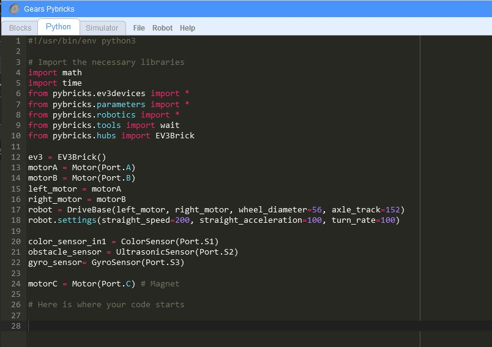

# FSS FLL Python Information
## Getting Started
### Using the Simulator
You don't need anything!  Just head over to the [FSS Gears Pybricks Simulator](https://kmortime.github.io/fss_fll_python/gears_pybricks/public/)
### Using the EV3 Bot
Official Lego Education instructions on how to get an EV3 bot up and running with Python: 

[https://education.lego.com/en-us/product-resources/mindstorms-ev3/teacher-resources/python-for-ev3](https://education.lego.com/en-us/product-resources/mindstorms-ev3/teacher-resources/python-for-ev3)

Note there are different versions of Python available for running on the EV3.  The current recommendation is to use the Lego Education supported EV3 Micropython which is a slimmed down and simplified version Python making it easier for beginners to use.  Micropython can be paired with a dedicated Visual Studio Code extension that includes project templates and documentation.

To run on an EV3, you'll need the following:
- MicroSD Card (4GB to 32GB of type microSDHC) to store the operating system and python programs on the EV3
- MicroSD Card reader or adapter to write the OS to the MicroSD Card
- Wifi USB dongle to connect to the EV3 wirelessly using Microsoft Visual Code Studio (not required, but recommended)
## Lessons
- Start Here! Write and simulate your first Python Program
- TBD
## Code Repo
Github Repo for FSS Python code:
https://github.com/kmortime/fss_fll_python/
## Simulation
[RUN THE SIMULATOR](https://kmortime.github.io/fss_fll_python/gears_pybricks/public/)

A EV3 robot simulation can be used to create python scripts and try them out on virtual robot.

### The fine print:
This simulation above is a clone of the [https://github.com/kendmaclean/gears_pybricks/](https://github.com/kendmaclean/gears_pybricks/) repository which itself is a fork of the [https://github.com/QuirkyCort/gears](https://github.com/QuirkyCort/gears) repository initially created by the great people at [https://www.aposteriori.com.sg/](https://www.aposteriori.com.sg/)
## More Resources
